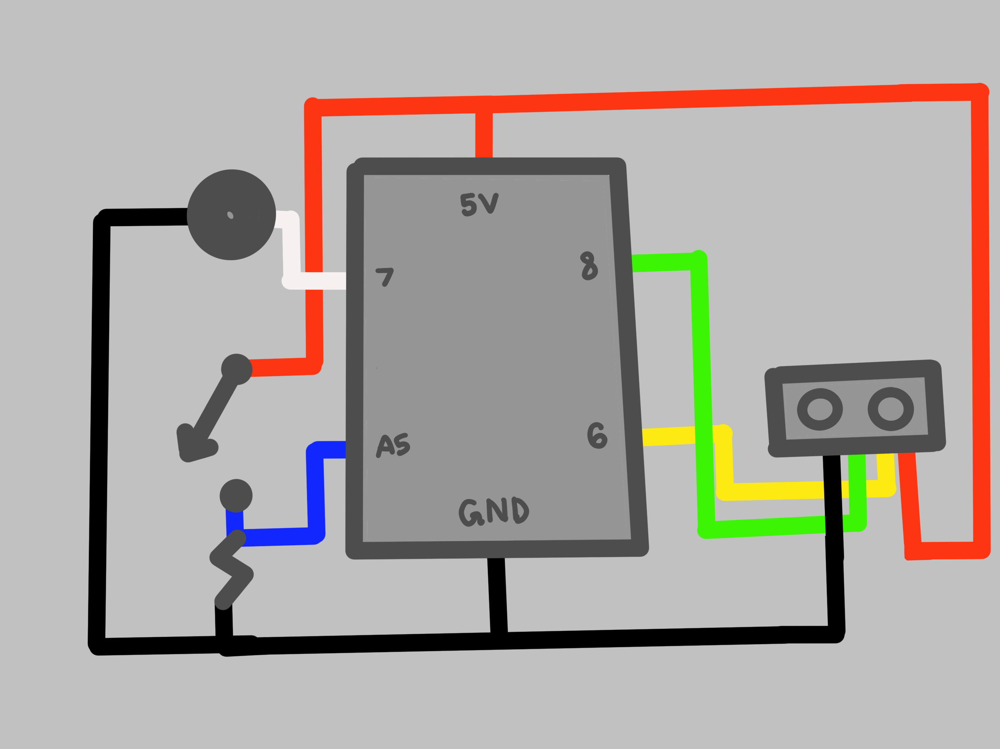

## Planning
- we wanted to use the ultrasonic sensor and the piezo speaker to create an instrument that is interactive.
- we felt that adding the button would allow the octave to be changed manually and for the instrument to be multidimensional.
- this is the schematic for the circuit:

## Circuit building
- the most common pins that were used were 5v and ground, as all the elements needed to be connected to those two except for the piezo speaker which only went through ground and pin 8.
- using a 10K resistor helped monitor the sound coming out of the speaker.
- we used the the red wires for 5v, the black wires for ground, the blue for analog input, and the rest of the colors for digital pins.
- here is the finished circuit:

## Coding
- first, we created an array based on the pitch file from the built in example for 'toneMelody' under 'digital'. this helped organize the tones and which order they would be in.
- a variable for the octave was created to accompany the if statment for when the button is pressed to allow users to switch between a low and high pitch.
- the sensor would read the trigger pin and generate a low, high, then low pulse. there is a delay of 5 and 10 microseconds to ensure a smooth transition.
- to generate sounds based on a hands distance from the sensor, the duration was divided into 2 and then by 2.91 and this was inputed into a 'cm' variable.
- this was then used in a string of if and else statements that assigned a note combined with an octave level based on the distance in the 'cm' variable created.

## Final Instrument

https://user-images.githubusercontent.com/98512587/162842150-ccc64c49-3a78-4802-868b-9702241cc87f.mp4

