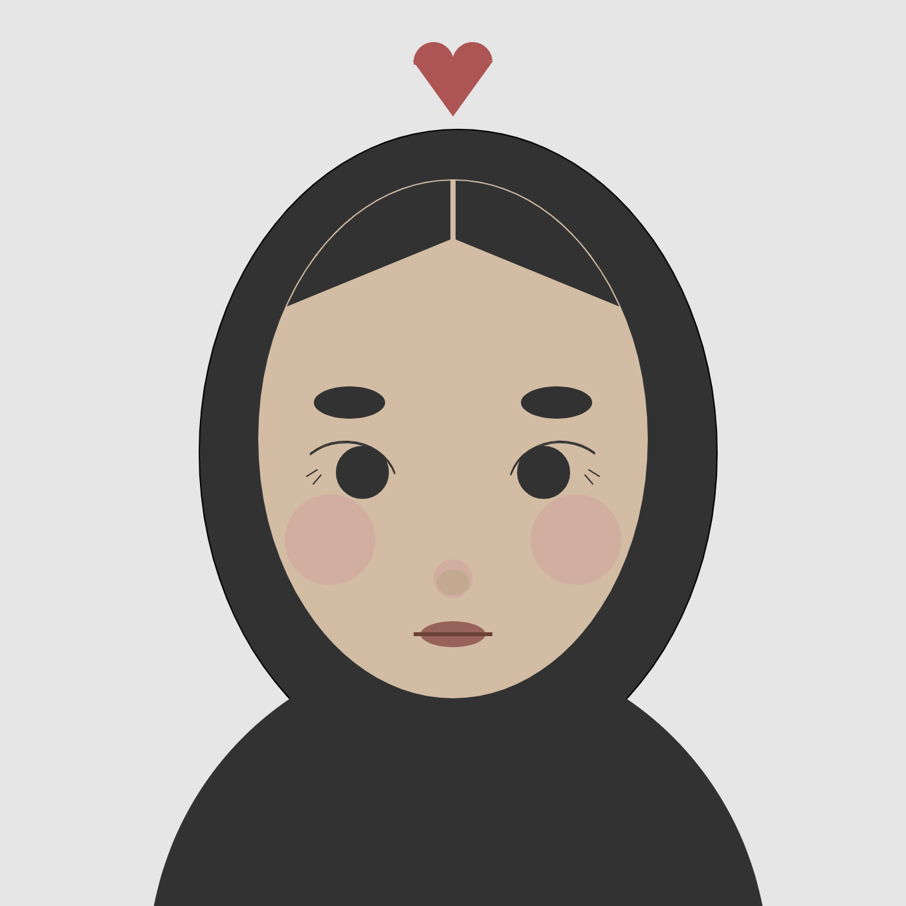

# My self portrait

## Difficulties
- I found the process of reflecting two identical features such as the eyes and eyebrows on the y-axis to be quite lengthy, however I did enjoy getting used to the coordinate system and found the end result very rewarding.
- figuring out the coded properties of an arch in order to draw the eyelids and heart took a while and involved many mistakes, but it was definitely worth it given how it helped me realize my vision of the overal image
## Insights
- I found labelling and spacing out each feature of the portrait very practical and helpful in navigating the process, especially as the coding became more complicated and lengthy overtime. This will definitely become a regular habit.
- Experimenting with each shape individually helped me be realistic in terms of my vision for the self-portrait. It also allowed me to become more comfortable in implementing repeatedly used shapes such as the ellipse.
- Overall, this exercise made me appreciate not only the intricacies of code and how important each component is to the end goal, but also how complex human faces and structures can be effectively mimicked by the most basic 2D shapes.
