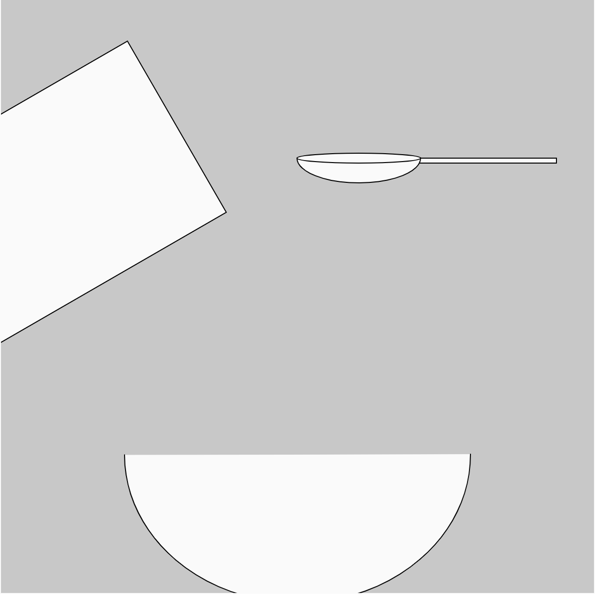
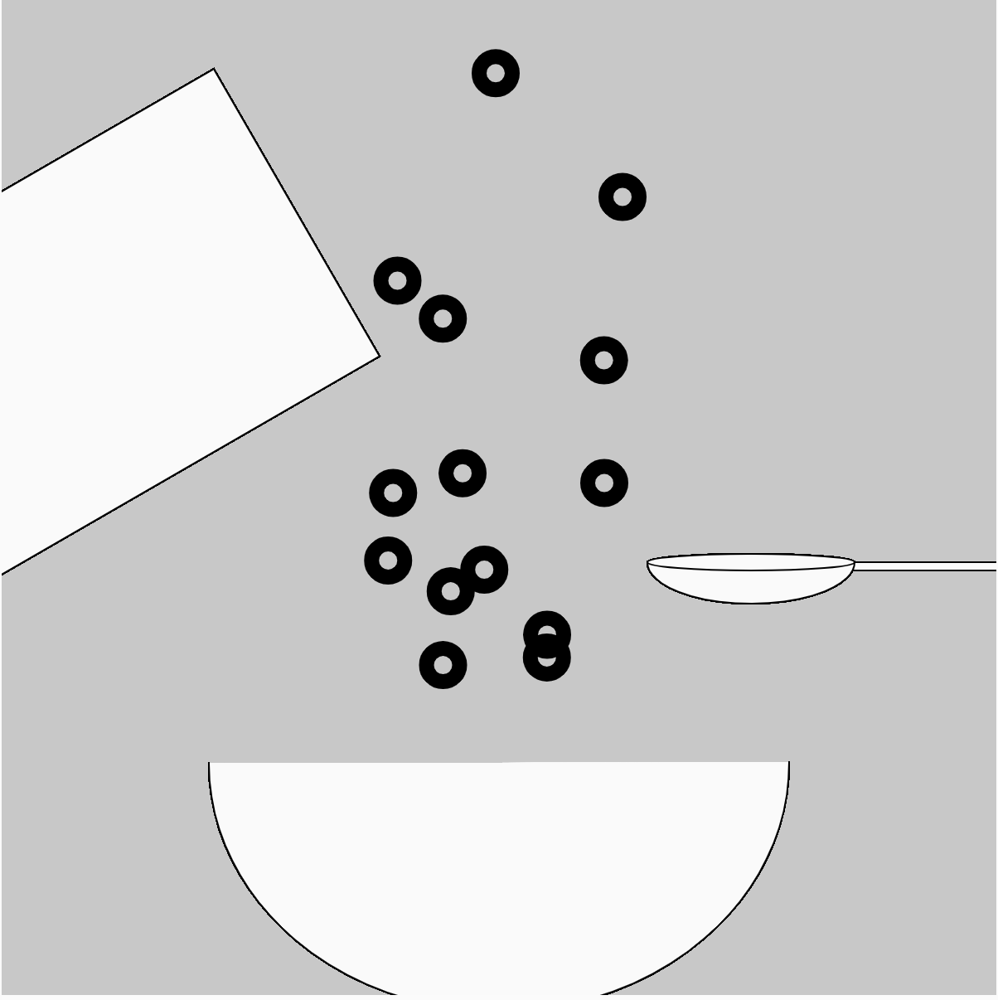
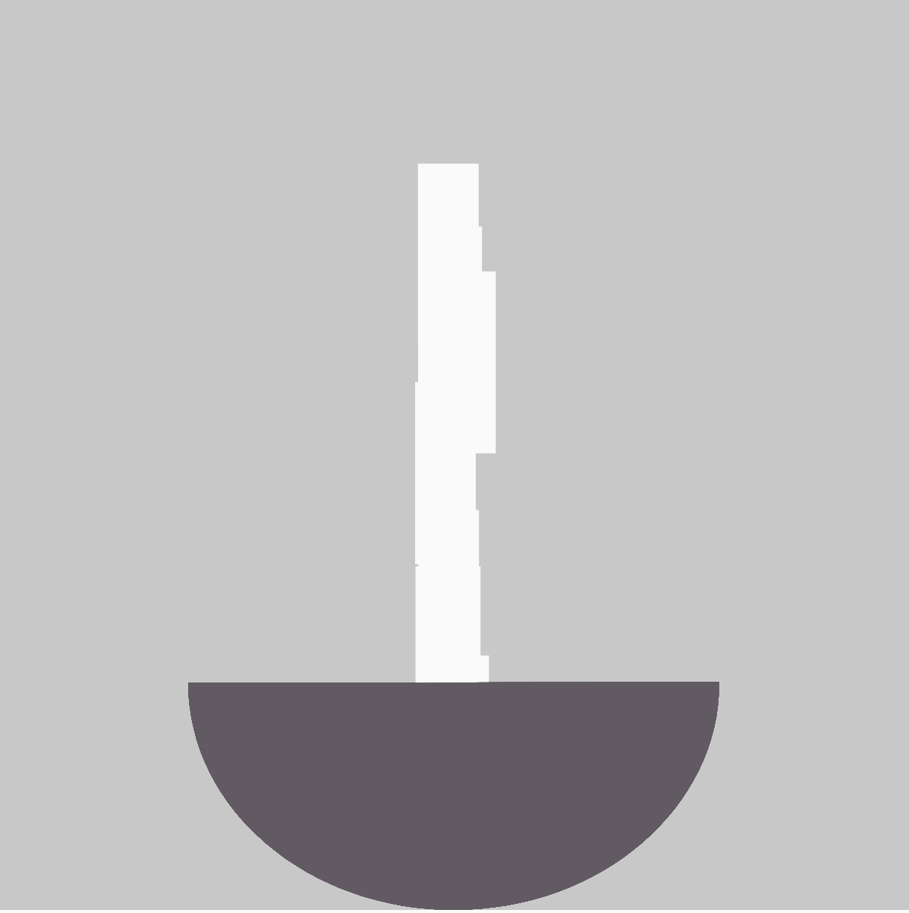

# Generative Artwork
## progress

- My concept for this artwork was inspired by something i do everyday, which is eat breakfast!
- i thought it would be fun to translate what is normally an everyday activity into an interactive and animated artwork
- i started by just putting together the simple shapes and using the rotate() transformation to turn the cereal box

- i used the class function to create the cereal and the array function to populate it as many times as i saw fit
- since i wanted there to be a continous stream of cereal, i thought of programming each one to restart from the beginning everytime it hit the bottom of the bowl
- at the start, the stream of cereal was too uniform and unnatural, so i used the random function so that the flow is different each time and gets more varied everytime it loops
- i also thought it would be fit to set the spoon shapes to follow the mouse coordinates so that there is an element of user interactivity
- the next stage was full of experimentation as i was trying to create a game like program where the user can switch between pouring cereal and milk. at first, i tried the button variable but using it would often crash my browser. so then, i resorted to if and while variables but i realised this wouldnt work without a mouseclicked function.
- i still struggled with the mouseclicked function as i didnt know how to flip between entire scenes
- but then, i had the idea to use transparency to my advantage, and programmed the mouseclicked function to change the transparency of each element in a particular scene everytime the mouse was clicked within the bounderies of a square button. this reminded me of drawing on multiple layers when making artworks or animation sequences.

- now that the user could switch between layers, i created the milk layer using both the class and array functions similar to how i did the cereal. this time, i created long rectangles with little space between each rectangle.
- this created the illusion of a continous stream. i randomized the x-axis between two close numbers so that the stream would vary everytime it loops.
- when i was sure that the program ran smoothly, i finalized elements such as shape, color, and text to improve the interface
- i also created a start page titled 'cereal simulator' and an end page.
- i used push() and pop() variables to stop the stroke weight of the cereal from applying to every other shape
## Final Result

