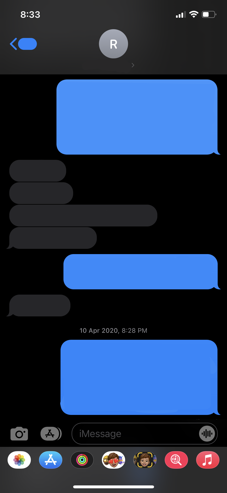
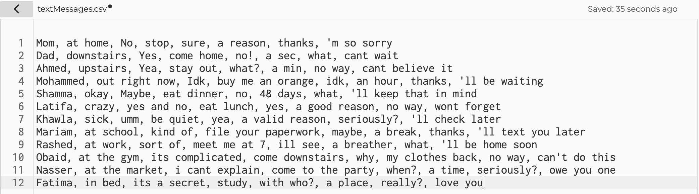
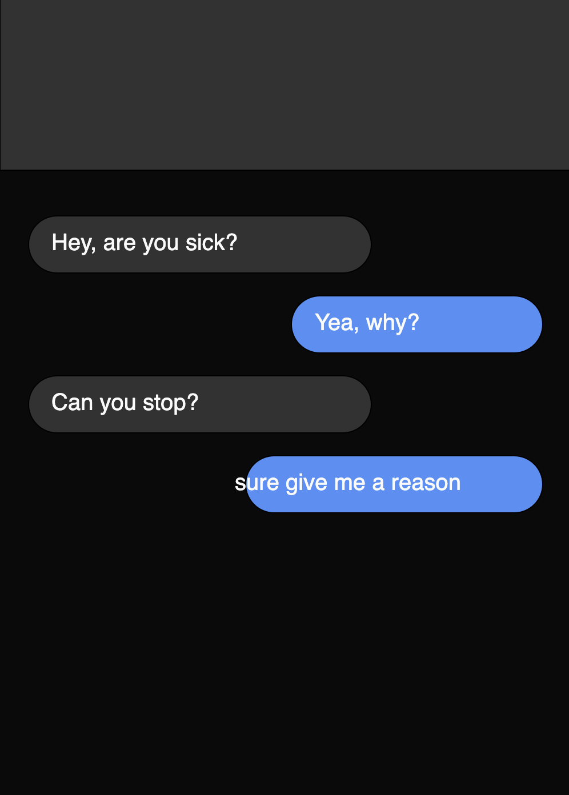
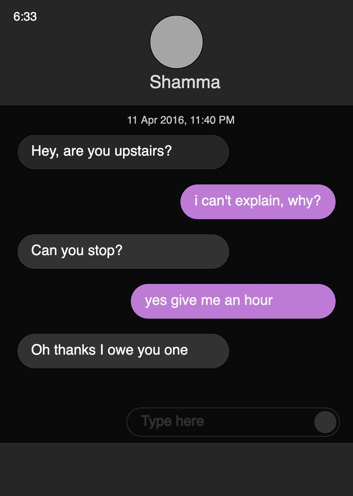
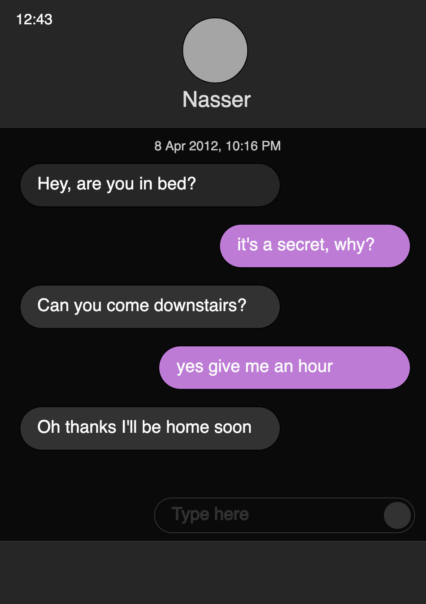

# Generative Text 
## Process:

- i was inspired by random and everyday text messages i exchange between myself and my family and friends. 
- i used this screenshot of my messages app to form the shapes and aesthetic

- at first, i created a template for my texts to follow:
Hey, are you _?
_, why?
can you _?
_ give me _
oh _ I _
- the underscores represent where the randomized words or phrases would go
- i created a csv file in the p5.js browser called "textMessages" and started creating the generative text
- i first made the mistake of putting the words or phrases of the same category in the same string, so i proceeded to change this and put one word or phrase of each category in one string in chronological order. i came up with different random inputs that would fit into the template and made a total of 12 strings. however, in my original vision, i wanted each input to be almost completely random, and not a set group of strings. so i kept creating new combinations and i ended up creating a total of 87 lines. this isnt every variation possible with the words and phrases but it was enough to generate unique outputs almost each time.

- after i was happy with the csv file, i loaded it into the main sketch page and started creating the shapes to mimick the screenshot shown before. 
- i was very happy with the way i could almost replicate such a sophisticated interface such as the imessages app
- i positioned each text in the curved rectangles using the text() function.
- it took me a while to determine how big each curved rectangle should be as i i had to make sure i was accounting for the biggest possible generated text
- i used the random() function within the round() function to create a random date and time each time the program is run. although this was a simple touch, i found that it really added to the context of the generated text conversation.
## Finished product

- im very pleased with the outcome of this program, as it does exactly what i wanted it to do. i purposely put in some weird and abstract words so that the outcome would not make sense while being gramatically correct.
- i had lots of fun generating different outcomes after i was done and laughing at the obscure conversation. 

- sometimes, like in the image above, the outcome would almost make sense but something would be off, which i really enjoyed discovering. Maybe this reflects how hard it is to reflect tone of voice in text messages, causing confusion and miscommunication
