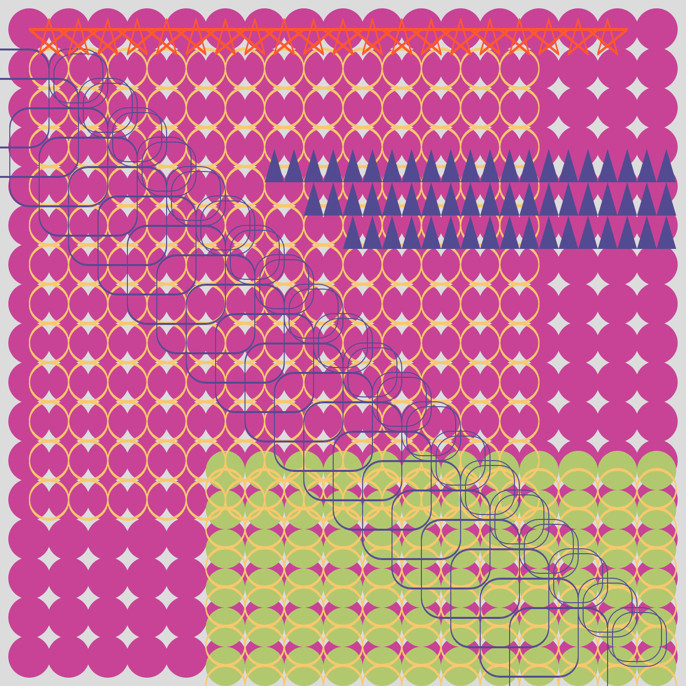
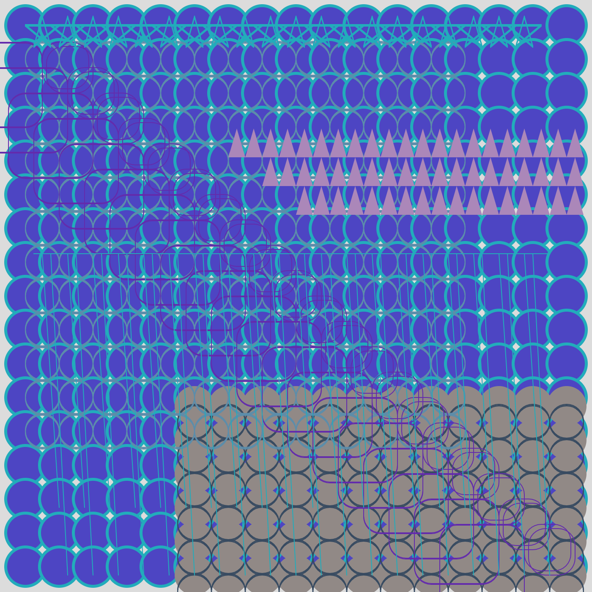
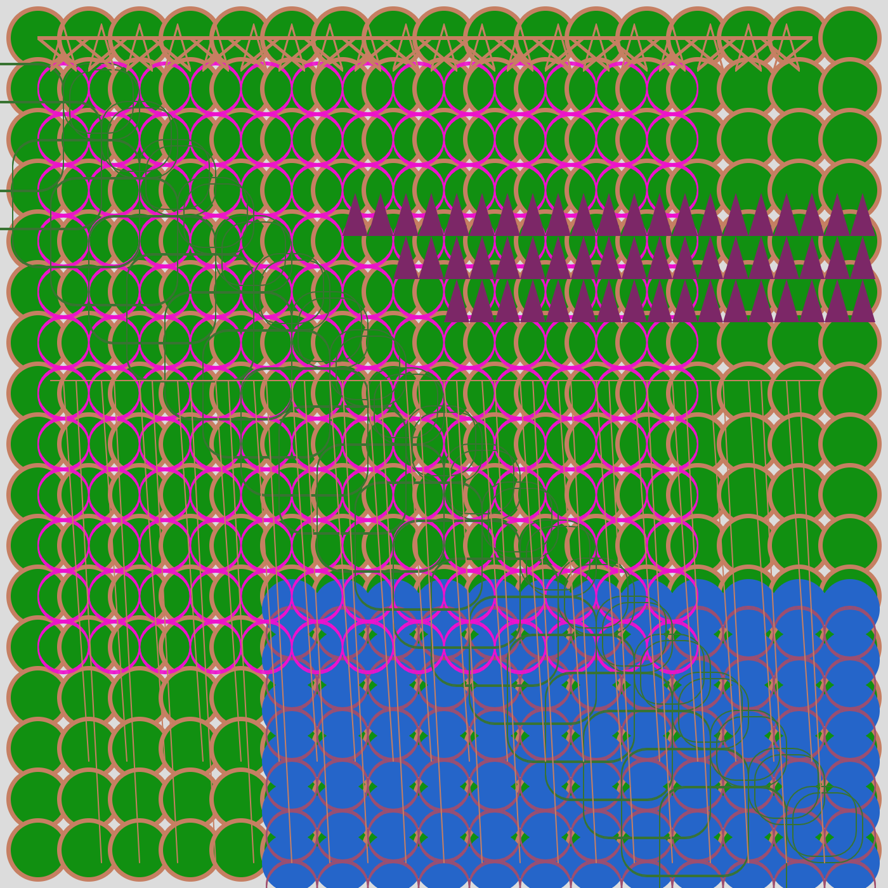
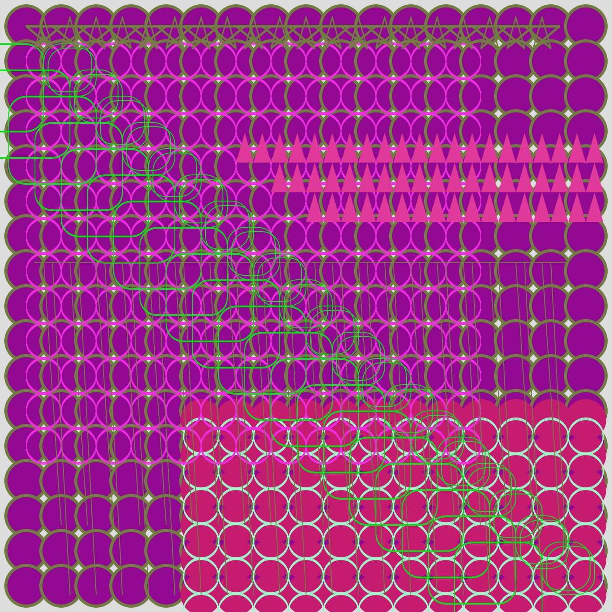

# My Artwork

## process
- i started with a looped circle background, i created two of these for dimension
- i started experiementing with looping shapes, and looped a rectangle with smooth edges diagonally. i created 3 of these in different sizes
- i couldnt figure out how to loop the triangle shape so i coded each one in the pattern
- i created variables for the random colors and incorporated this into each of the shapes
- i used looped lines to create stars across the top of the artwork.
## challenges
- it took me a while to get used to the while and for functions when creating loops of shapes
- the stars was made of individual lines and it took a while to coordinate each one appropriately
## what i learned
- complicated looking artwork can be made of simple loops
- randomizing the colors each time gives it an entirely new feel and draws attention to different shapes.
