## Inspiration
- initially, i was heavily inspired by the cooking games i grew up with and loved playing. ive always had such a vivid memory of the different interactions and steps the user would need to take to complete a recipe.
- i was especially fond of the game below because of its attractive pixelated interface and range of possibilities
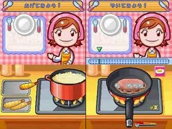
## Beiginning stages
- So first, i started experimenting with creating pixelated art in order to insert them into the game as images
- i wanted to create a simple game in which the user would combine different ingredients to make a chocolate cake
- i used the procreate app for the images and created a new brush that had a square shape to create the pixelated effect. i started modelling the different aspects such as the avatar, flour, bowl, chocolate, and eggs.
- after downloading them however, since the pixels were so small, the image became blury everytime i tried making it bigger. so i used a [pixel art scaler website](https://yal.cc/r/19/upscale/) to scale the images and make them bigger so that the resolution would be maintained no matter the size of my canvas
- here are some example of the images i created:
.png)
.png)
.png)
## biggest predicted challenge and how i solved it
- Since in my previous assignment where i created a cereal simulator i used arrays, i dont think i would have much trouble adapting the principle again and improving on it. 
- however, i think the hardest thing i faced in that assignment was trying to figure out how to change a aspect of the program with a mouse click in a way that would last and not disappear momentarily after the mouse is clicked.
- I wanted to create a stage in this game where the user can crack an egg into a bowl by clicking the mouse within the range of the bowl. i also wanted them to be able to then grab another egg and crack it into the bowl.
- at first, i loaded the egg and bowl images into the program, and started experimenting with the if() and while() variables to see if i can allow the user to crack an egg by simply touching the edge of the bowl. That did not work as the crack on the egg would only last as long as the mouse stayed in that position
- so then i started to work with mousePressed() and mouseClicked() functions. However i faced the same problem where i would either have to contionusly press for the image to change or it would only last one click.
- i then discovered the mouseReleased() function and started seeing what i could do with it. at first i tried asking the function to draw the function at a specific x and y point, but that didnt work  
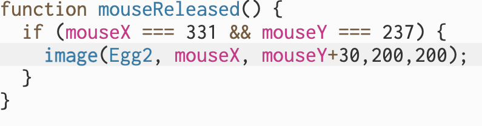
- so then i tried to assign a new value to the variable that was given the loaded image of uncracked egg. i made it equal to the variable of the cracked egg image  
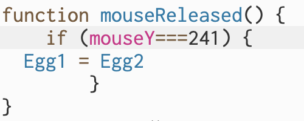
- this worked really well, and so i expanded the parameters of where the mouse could be released in order for the egg to only be cracked when it is in the bowl. i also created an else{} where the egg variable returned to its default to accomodate for grabbing other eggs from outside the bowl parameters and cracking it again.  
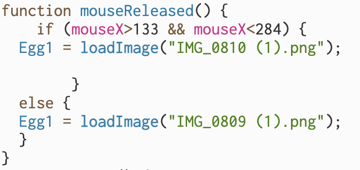
- After this, i really wanted an animation of the egg yolk to fall into the bowl everytime an egg was cracked. so i created another image of the yolk and loaded it into the program, made the X and y positions follow the mouse, and then added a global variable called YolkYPosition that i gave a certain speed to. i added the speed to the y position so that it would fall into the bowl.
- i then set the yolkYPosition to 30 everytime the mouse is released so that it would fall from the egg everytime its cracked.
- To make sure the yolj was only visible when the egg was cracked, i used the transparency properties i learned from my last assignment to control its visibility when the mouse is pressed. i used the tint() and push() pop() variables for this.  
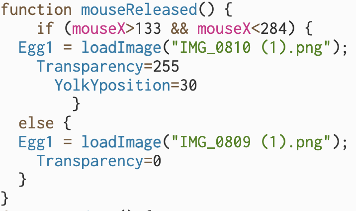
- in the end i was really happy with the result because it meant that i could apply this to many other stages i have planned for the game and not have to create a whole other layer for one action.
- i also look forward to enhancing this stage maybe with a egg crack sound, or additional visuals in the background such as a egg carton the user can keep picking eggs from.
## End Result

## Progress report 1
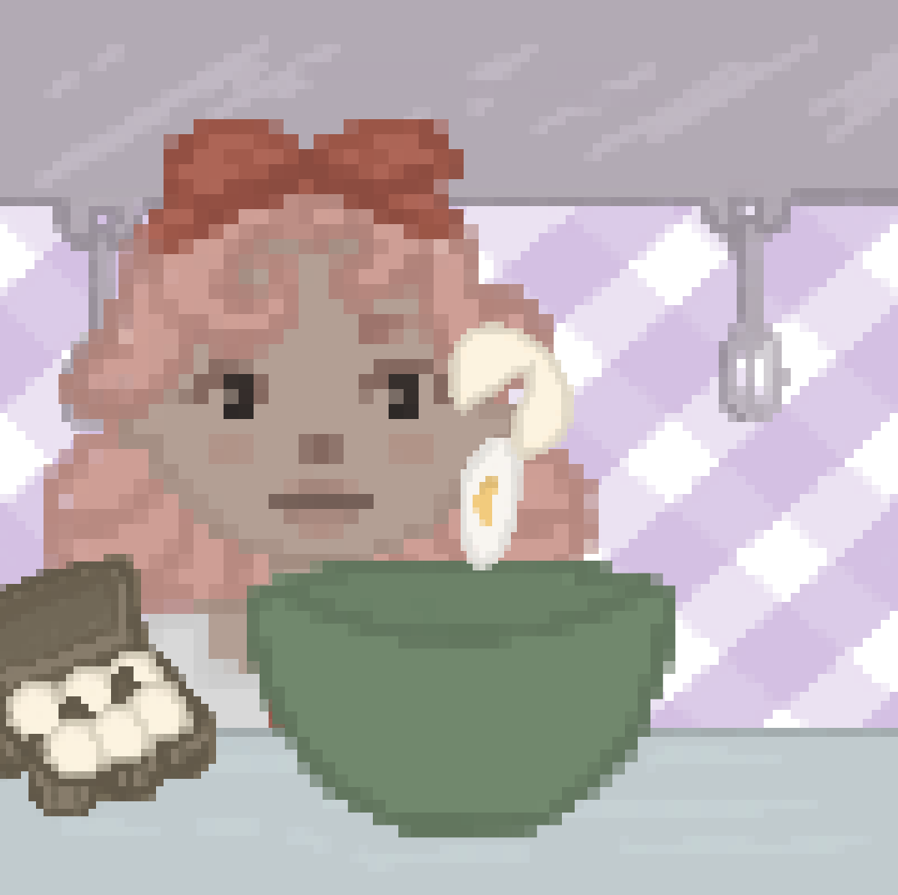
- i improved the egg stage above by putting in the rest of the images, and putting an egg carton that loses an egg everytime its clicked to mimick real life. i did this by naming the egg carton images using numbers in succession and specificying that in the mousePressed function.
- i created the rest of the stages on seperate p5.js sketch files to avoid overlap and so that i can clearly see what happens in each stage. however, this will pose a problem later on.
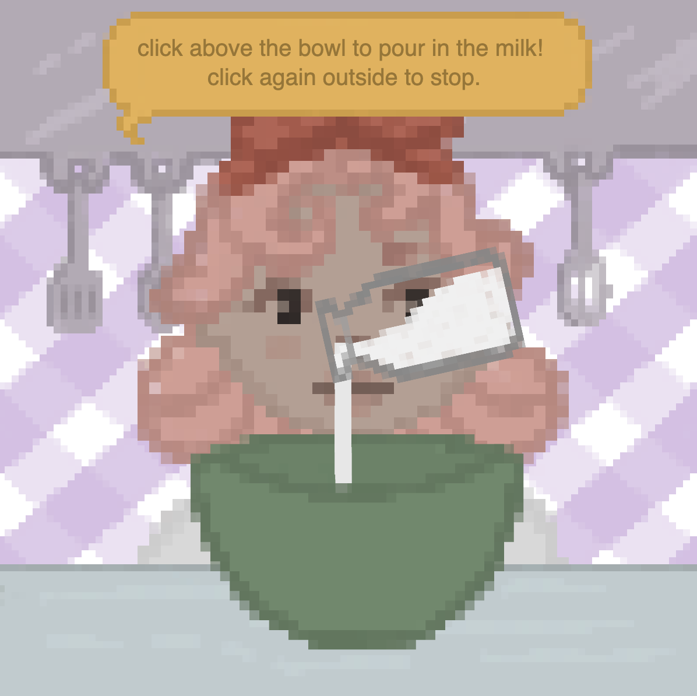
- in the milk stage, i implemented my array work from a previous assignment to create the moving milk. i specifyed this action to only happen when the bottle was tilted and within the parameters of the bowl
- Here, i started adding a text bubble above the avatar to help users navigate the game better
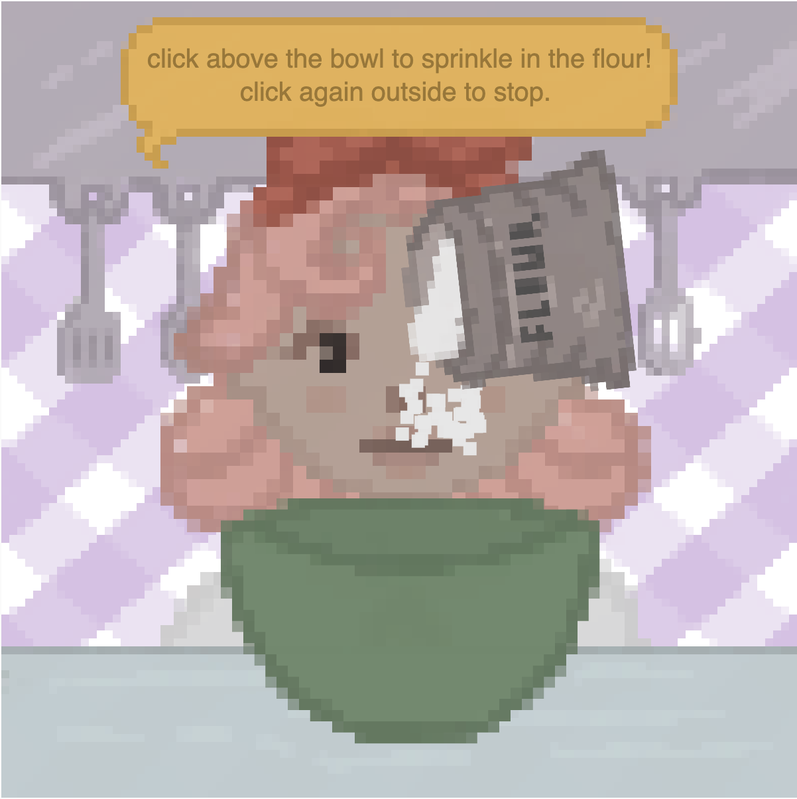
- in the flour stage, i implemented a similar array and class function as the milk stage but scattered the grain shape a bit more to mimick real flour
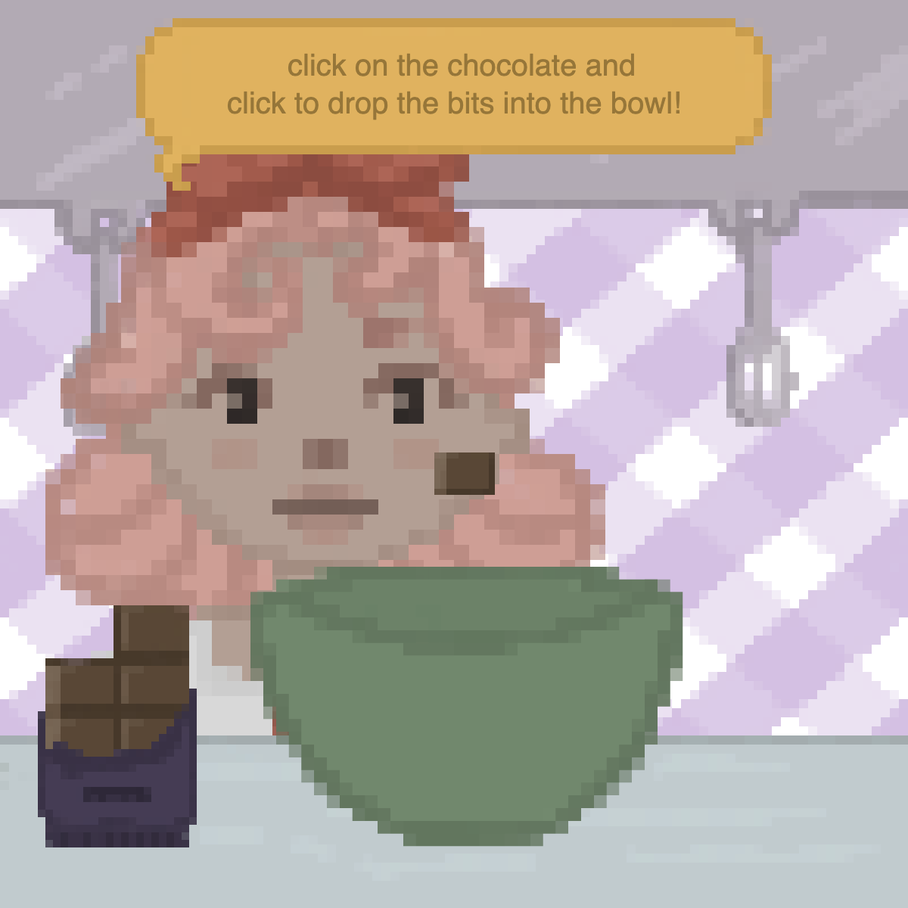
- in the chocolate stage, i used a similar code to the milk cartons, where the chocolate would lose bits everytime it was pressed. at the same time, a bit would appear in the users mouse and can be 'put' into the bowl by pressing within the parameters. 
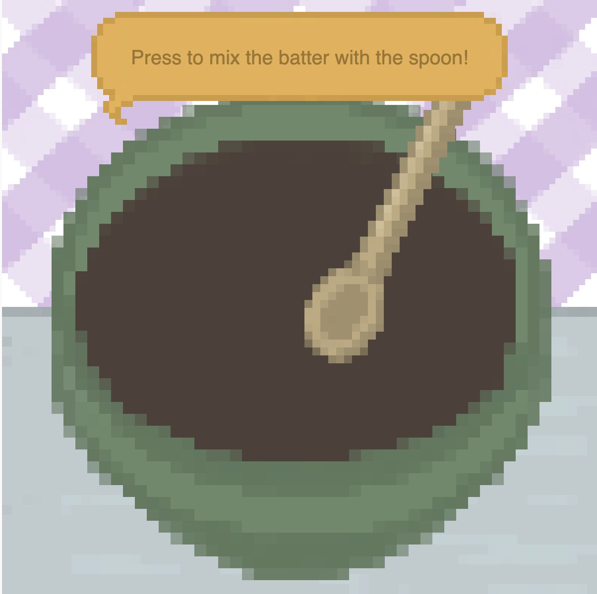
- in the mixing stage, i used the mouseIsPressed() function to allow the users to switch between the spoon being outside and inside the the bowl. this is possible only within the parameters of the brown mixture
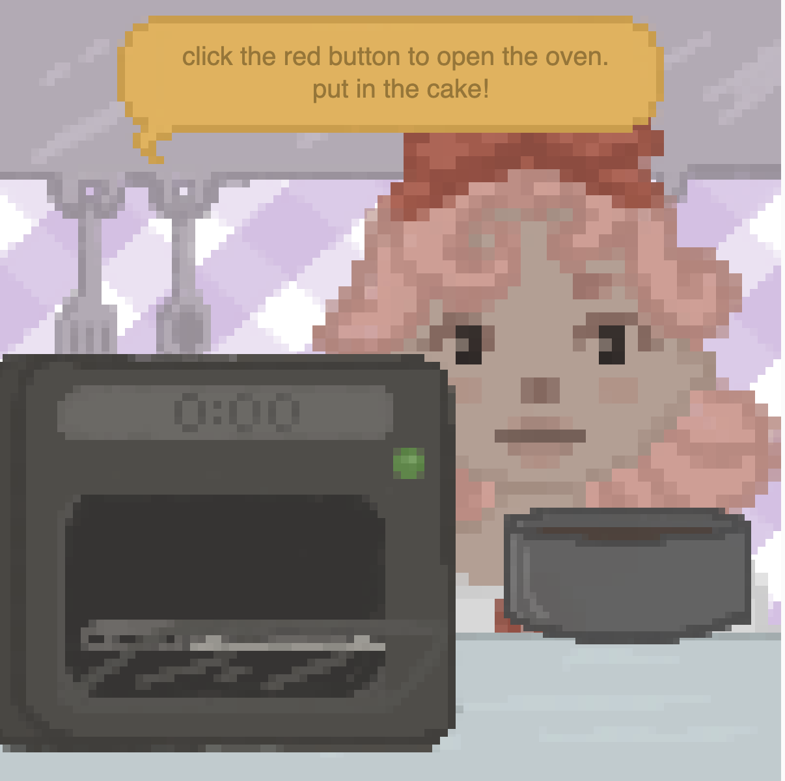
- here, i switched between the oven being closed to being open using the mouseReleased() function specified around the red button parameters. at the same time, an image of the pan with the cake would appear at mouseX and mouseY and users can click inside the oven to 'place it', which would switch to the image with the pan inside the closed oven
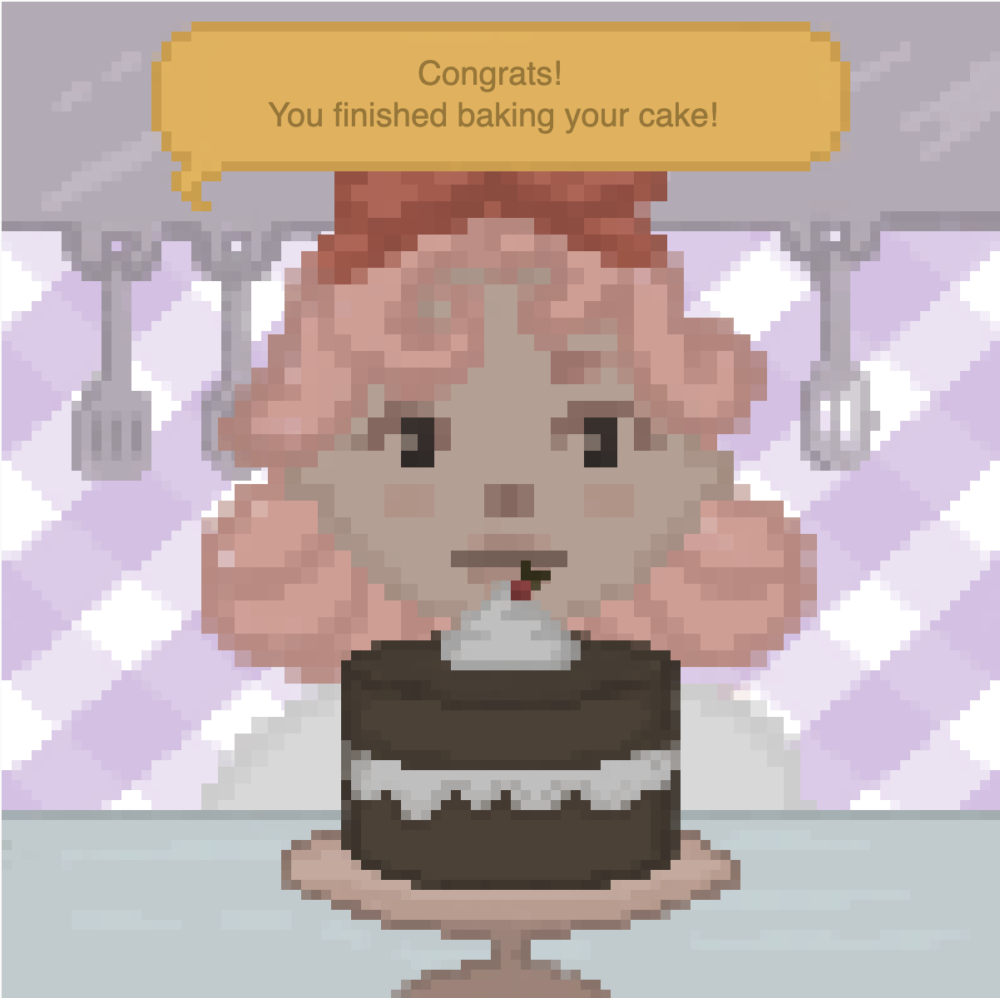
- this is the end page, where there is an image of the cake and a text to let users know that it is the end of the game
### An issue i ran into
- when i started combining the diferent stages into one p5.js sketch file, i was able to figure out how to switch between the stages by using the tint(transparency) vaiable, however this slowed down the game significantly. This happened when i combined only 2 of the stages, which means the game would slow down even more if i tried incorporating all 8 stages.
- so instead, i opted for moving the elements of the stage by 1000 pixels everytime they were finished. to do this, i created variables for each stage such as:
- `let titlePageXandY = 0
- let flourStageXandY = 0`
